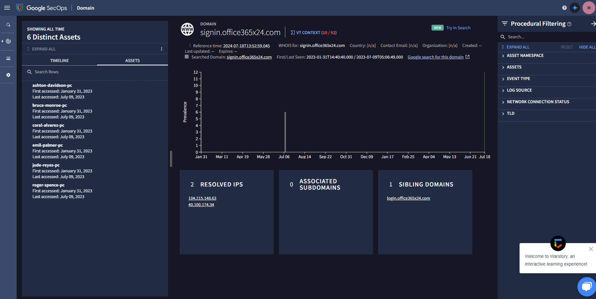
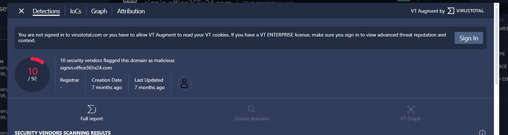
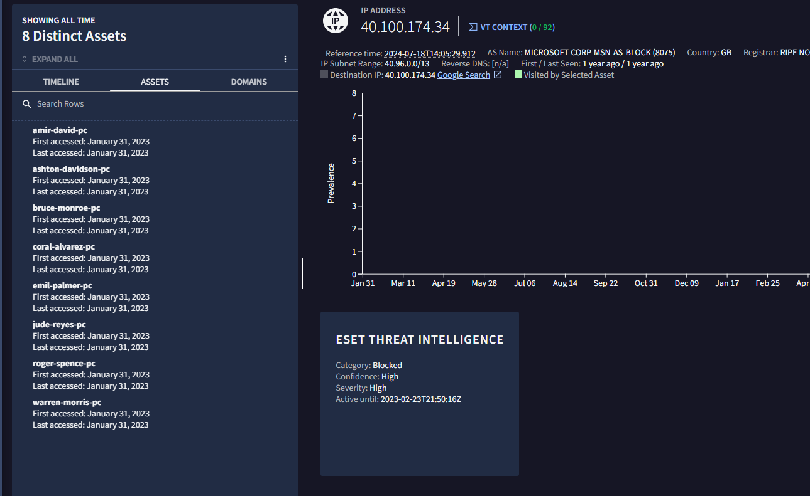
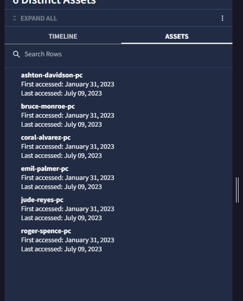
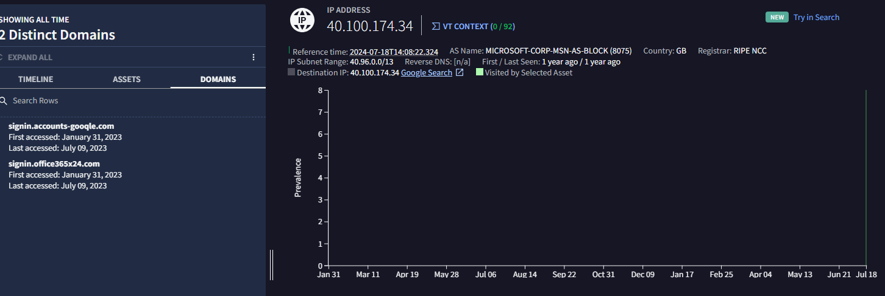

# 🔍🛡️ Chronicle Investigation for Phishing Email

## 🎯 Objective
The objective of this investigation is to analyze the domain `signin.office365x24.com` using Chronicle to determine if it is associated with phishing activities at a financial services company. This involves examining domain access, related IP addresses, and investigating potential malicious activity.

## 📖 Scenario
As a security analyst, you received an alert about a phishing email containing the domain `signin.office365x24.com`. Your task is to investigate if other employees have received similar emails and whether any have accessed the domain. Using Chronicle, you'll gather evidence to assess the severity and impact of this phishing attempt.

### 📚 Skills Applied
- 🔍 Investigating domains and IP addresses in Chronicle.
- 🛡️ Analyzing threat intelligence data for malicious indicators.
- 📝 Documenting findings in the incident handler's journal.

### 🛠️ Tools Used
- 💻 Google Chrome for optimal Chronicle functionality.
- 📊 Chronicle's interface for querying and analyzing log data.
- 📝 Incident handler's journal for recording findings.

## 📝 Steps
Follow these steps to investigate the `signin.office365x24.com` domain and answer the associated questions:

1. **🔍 Perform Domain Search**
   - Launch [Chronicle](https://chronicle.security) and enter `signin.office365x24.com` in the search bar. Click Search.
   

2. **🔍 Explore Domain Details**
   - Click on `signin.office365x24.com` under DOMAINS to view details such as VirusTotal information and WHOIS data.
   - Click on RESOLVED IPS to explore related IP addresses like `40.100.174.34`.
   
   

3. **🔍 Investigate TIMELINE and ASSETS**
   - Click on TIMELINE to view events related to the domain, including HTTP requests like GET and POST.
   - Click on ASSETS to identify devices or systems that accessed the domain.
   

4. **🔍 Investigate Related IP Address**
   - Under RESOLVED IPS, click on `40.100.174.34` to investigate if other domains are associated with this IP address.
   

5. **📝 Document Findings**
   - Use the incident handler's journal to record assets, IP addresses, POST requests, and other relevant details gathered during the investigation.

## 📚 Training Questions

1. **Question 1**
   Which assets accessed the `signin.office365x24.com` domain? Select three answers.
   - thomas-garcia-pc
   - emil-palmer-pc
   - roger-spence-pc
   - coral-alvarez-pc

   **Correct Answer:** thomas-garcia-pc, emil-palmer-pc, roger-spence-pc

2. **Question 2**
   Which IP address does the `signin.office365x24.com` domain resolve to?
   - 10.0.0.222
   - 45.32.8.8
   - 40.100.174.34
   - 10.0.29.22

   **Correct Answer:** 40.100.174.34

3. **Question 3**
   How many POST requests were made to the IP address `40.100.174.34`?
   - 11
   - 3
   - 8
   - 1

   **Correct Answer:** 3

4. **Question 4**
   Some POST requests were made to `signin.office365x24.com`. What is the target URL of the web page that the POST requests were made to?
   - http://office365x24.com/login.exe
   - http://signin.office365x24.com/login.php
   - http://accounts-gooqle.com/login.php
   - http://accounts-gooqle.com/login.txt

   **Correct Answer:** http://signin.office365x24.com/login.php

5. **Question 5**
   Which domains does the IP address `40.100.174.34` resolve to? Select two answers.
   - euw.adserver.snapads.com
   - cloud2.xdnscloud.com
   - signin.accounts-gooqle.com
   - signin.office365x24.com

   **Correct Answer:** signin.accounts-gooqle.com, signin.office365x24.com

