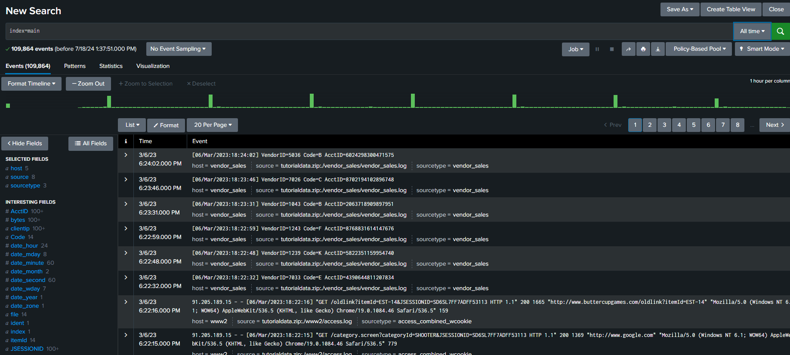
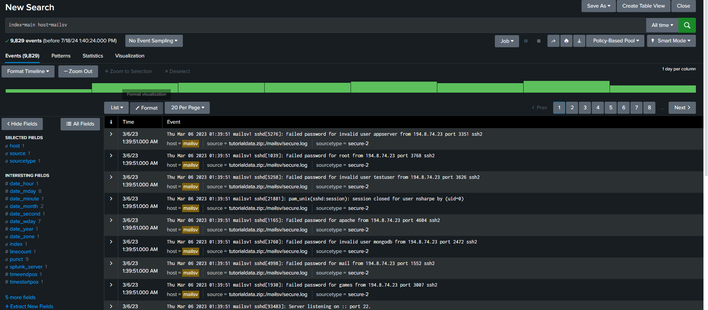
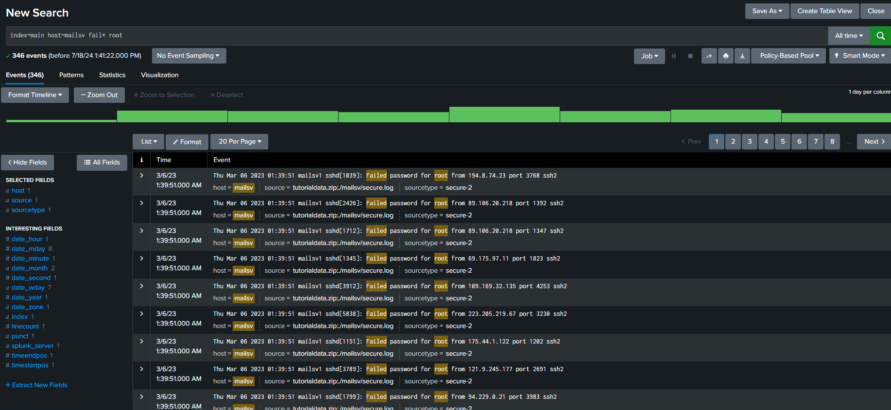

# 🔒🔍 Splunk Data Analysis for Security Assessment

## 🎯 Objective
The objective of this task is to analyze Splunk data to identify any security issues related to failed SSH logins for the root account on Buttercup Games' mail server. This involves using Splunk queries to pinpoint specific events and understand the security implications.

## 📖 Scenario
As a security analyst at Buttercup Games, you've been assigned to investigate potential security issues with the mail server. Specifically, you need to examine failed SSH login attempts for the root account to ensure there are no unauthorized access attempts.

### 📚 Skills Applied
- 🔍 Querying and analyzing data in Splunk.
- 📊 Interpreting log data to identify security events.
- 🔒 Understanding of SSH security implications.

### 🛠️ Tools Used
- 💻 Splunk Cloud platform for data analysis.
- 📝 Incident handler's journal for documenting findings.

## 📝 Steps
Steps followed to analyze and assess security issues using Splunk:

1. **🔍 Upload Data to Splunk**
   - Upload provided data (`tutorialdata.zip`) into Splunk Cloud to start analyzing.

2. **📊 Search and Explore Data**
   - Perform an initial search (`index=main`) to confirm data ingestion and indexing.
   

3. **🔍 Narrow Search to Mail Server Events**
   - Filter events from Buttercup Games' mail server (`index=main host=mailsv`).
   

4. **🔒 Investigate Failed SSH Logins**
   - Refine search to identify failed SSH logins for the root account (`index=main host=mailsv fail* root`).
   

5. **📝 Document Findings**
   - Record details of identified events in the incident handler's journal for further analysis.

## 📜 Project Description
This project focuses on using Splunk to investigate and mitigate potential security threats related to failed SSH logins on Buttercup Games' mail server. By leveraging Splunk's capabilities, we ensure proactive security measures to protect sensitive systems and data.

## 📚 Training Questions

1. **Question 1**
   How many events are contained in the main index across all time?
   - 100-1,000
   - Over 100,000
   - 10,000
   - 10-99
   
   **Correct Answer:** Over 100,000
   Entering a search for all events in the main index retrieves 109,864 events.

2. **Question 2**
   Which field identifies the name of a network device or system from which an event originates?
   - index
   - source
   - sourcetype
   - host
   
   **Correct Answer:** host
   The host field specifies the name of a host, such as a network device or other system, from which an event originates.

3. **Question 3**
   Which of the following hosts used by Buttercup Games contains log information relevant to financial transactions?
   - www2
   - www1
   - www3
   - vendor_sales
   
   **Correct Answer:** vendor_sales
   The vendor_sales host provides information about Buttercup Games' retail sales, such as the number of products sold.

4. **Question 4**
   How many failed SSH logins are there for the root account on the mail server?
   - One
   - 100
   - None
   - More than 100
   
   **Correct Answer:** More than 100
   There are over 100 failed SSH logins for the root account on the mail server.

## 📄 Summary
Through thorough analysis using Splunk, we identified and reviewed events related to failed SSH logins on the mail server. This investigation helps in ensuring the security posture of Buttercup Games' infrastructure by addressing potential vulnerabilities and unauthorized access attempts effectively.
