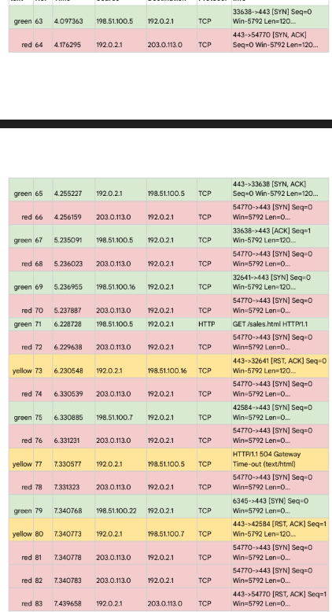

# 🕵️‍♂️🔍 Network Traffic Analysis for TravelAgencyPromoSite

## 🎯 Objective
The goal of this project is to analyze TCP traffic to identify and mitigate a network attack affecting the company’s promotional website. The analysis will help determine the cause of the issue and provide insights into potential network vulnerabilities.

## 📖 Scenario
You work as a security analyst for a travel agency that advertises sales and promotions on the company’s website. The employees of the company regularly access the company’s sales webpage to search for vacation packages their customers might like.

One afternoon, you receive an automated alert from your monitoring system indicating a problem with the web server. You attempt to visit the company’s website, but you receive a connection timeout error message in your browser.

You use a packet sniffer to capture data packets in transit to and from the web server. You notice a large number of TCP SYN requests coming from an unfamiliar IP address. The web server appears to be overwhelmed by the volume of incoming traffic and is losing its ability to respond to the abnormally large number of SYN requests. You suspect the server is under attack by a malicious actor.

You take the server offline temporarily so that the machine can recover and return to a normal operating status. You also configure the company’s firewall to block the IP address that was sending the abnormal number of SYN requests. You know that your IP blocking solution won’t last long, as an attacker can spoof other IP addresses to get around this block. You need to alert your manager about this problem quickly and discuss the next steps to stop this attacker and prevent this problem from happening again. You will need to be prepared to tell your boss about the type of attack you discovered and how it was affecting the web server and employees.

### 📚 Skills Learned
- 🛡️ Identification and analysis of network protocols and traffic.
- 🧠 Critical thinking and problem-solving in cybersecurity contexts.
- 📋 Documentation and reporting of network security incidents.

### 🛠️ Tools Used
- 🖥️ Network protocol analyzer (e.g., Wireshark) for capturing and analyzing network traffic.
- 🌐 Understanding of TCP/IP model layers and network protocols (e.g., TCP, HTTP).

## 📝 Steps
Steps followed to conduct the network traffic analysis:

1. **🔍 Review Supporting Materials**
   - Access and review the following documents:
     - Wireshark log of the incident
     - TCP/IP model layers
     - Network protocol descriptions

2. **📊 Analyze the Traffic**
   - Load the Wireshark log and examine the timestamps, source and destination IP addresses, and protocol details.
   - Identify the sequence of network events leading up to the connection timeout error.
     

3. **📝 Document Findings**
   - Record the details of the TCP SYN requests and the web server’s responses.
   - Determine the cause of the issue and which network protocol was affected.

4. **📋 Report the Incident**
   - Prepare a follow-up report detailing your analysis, findings, and recommendations for addressing the issue.

## 🔍 Step-By-Step Instructions

1. **🔍 Review Supporting Materials**
   - Open the Wireshark log file to analyze the captured network traffic data.

2. **📊 Analyze the Traffic**
   - The Wireshark log shows a large number of incoming TCP SYN requests from an unfamiliar IP address to the web server.
   - The web server is overwhelmed and unable to respond to the excessive number of SYN requests, leading to a connection timeout error.

3. **📝 Document Findings**
   - The excessive number of TCP SYN requests is indicative of a SYN flood attack, a type of Denial of Service (DoS) attack.
   - This attack overwhelms the web server, preventing it from responding to legitimate requests and causing a connection timeout error.

4. **📋 Report the Incident**
   - The network protocol impacted during this incident was TCP, as the web server was unable to handle the excessive number of SYN requests.
   - The SYN flood attack caused the web server to become unresponsive, affecting the website’s availability to employees and customers.

### Report Writing

- Describe the attack: The main symptoms or characteristics of a SYN flood attack include a large number of SYN requests from a single or multiple IP addresses, overwhelming the server’s resources.
- Explain how it affected the organization’s network: The SYN flood attack caused the web server to become unresponsive, leading to a connection timeout error for users trying to access the website.
- Describe the potential consequences of this attack: The attack can result in downtime for the website, loss of business, and damage to the company’s reputation.
- Suggest potential ways to secure the network: Implementing rate limiting, SYN cookies, and more robust firewall rules can help mitigate the impact of SYN flood attacks and prevent similar incidents in the future.
